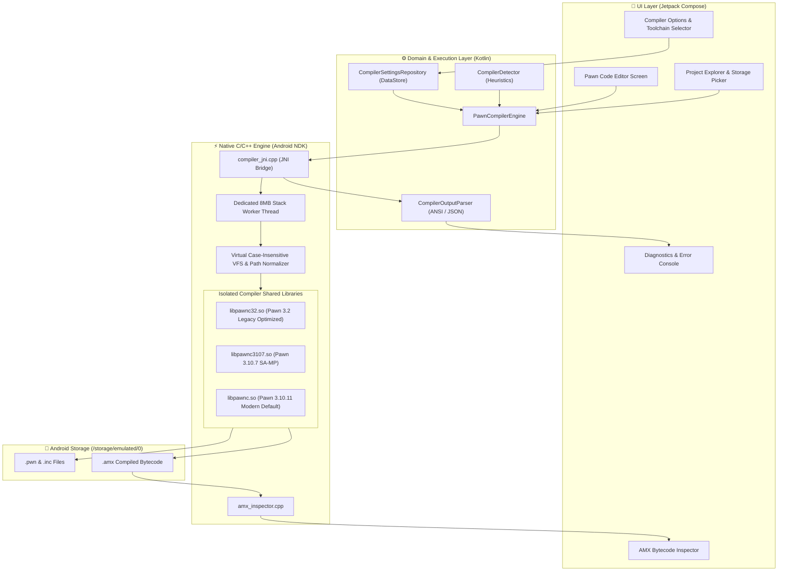

# Pawno Studio Mobile

<p align="center">
  
</p>

<p align="center">
  <strong>The Ultimate Android IDE & Native Pawn Compiler for SA-MP and open.mp Development</strong><br>
  <em>Compiled 100% locally on Android with zero cloud dependency. Desktop-grade compilation speed right in your pocket.</em>
</p>

<p align="center">
  <a href="https://github.com/DrgxByteZone/Pawno-Studio-Mobile/releases"></a>
  
  
  
  
  
  
  <a href="LICENSE"></a>
</p>

---

## 📌 Overview

**Pawno Studio Mobile** is a production-grade, native integrated development environment (IDE) built specifically for Android to write, refactor, and compile **Pawn** scripts for **San Andreas Multiplayer (SA-MP)** and **open.mp**.

Engineered for extreme performance and rock-solid stability, Pawno Studio Mobile embeds **three complete, isolated native compiler engines** directly into the Android application via the **Android NDK** and **JNI**:
1. **CompuPhase Pawn 3.2.3664 (Legacy Engine)**: Heavily optimized for classic Indonesian and international roleplay gamemodes.
2. **Zeex Pawn 3.10.7**: Legacy SA-MP Community edition.
3. **Zeex Pawn 3.10.11**: Modern open.mp and SA-MP community standard compiler.

It offers **100% offline, local compilation** with zero reliance on cloud servers or external binaries—delivering blisteringly fast compile times directly on your smartphone or tablet.

Whether developing modular YSI frameworks or maintaining monolithic 100,000+ line gamemodes (like *Atlantic.pwn*), Pawno Studio Mobile handles massive include trees, deep preprocessor macros, and heavy AMX binaries effortlessly.

---

## ⚡ Key Highlights & Features

- **🚀 Triple Native C Compiler Engines**:
  - Run **Pawn 3.2 Legacy**, **Pawn 3.10.7**, and **Pawn 3.10.11** on your device.
  - Native architecture builds for `arm64-v8a`, `armeabi-v7a`, and `x86_64`.
- **🧠 Smart Auto-Detection & Auto-Recovery**:
  - Automatically identifies whether your gamemode uses modern Community syntax or legacy CompuPhase syntax.
  - If a legacy script fails on Pawn 3.10, the engine automatically attempts fallback recovery with Pawn 3.2 and notifies you.
- **⚡ 57,000x Algorithmic Speed Optimization**:
  - Custom-patched CompuPhase Pawn 3.2 engine replacing $O(2^N)$ call-graph recursion with **Memoized DFS**.
  - Replaced $O(N^2)$ linked-list traversals with $O(1)$ tail pointers and sequential index caches.
  - Added user-space 64 KB RAM write buffers, cutting millions of redundant disk syscalls.
- **📂 Android FUSE Filesystem Resilience**:
  - Stack-based path normalizer resolving Windows-style relative includes with `..` (e.g., `#include "..\YSI_Internal\y_compilerdata"`).
  - Multi-chunk `fread` loop preventing buffer truncation on large files (>4 MB).
  - Virtual case-insensitive path resolver mapping `#include <a_samp>` to `A_SAMP.INC` on Android Linux filesystems.
- **📱 Tailored Mobile Code Editor**:
  - Fast, low-latency syntax highlighting for Pawn keywords, directives, and numbers.
  - Dedicated quick-access symbol bar (`{`, `}`, `(`, `)`, `;`, `[`, `]`, `&`, `|`, `"`, `=`, `#`).
  - Jump-to-line error navigation directly from compiler diagnostics.
- **📊 Real-Time Compiler Diagnostics Console**:
  - Live output stream with color-coded errors and warnings.
  - Elapsed compilation timer and exit code reporting.
- **🔍 Native AMX Bytecode Inspector**:
  - Inspect compiled `.amx` binaries: view public functions, native imports, header details, and stack/heap memory consumption.
- **🎨 Modern Dark UI (Google Stitch Minimalist Design)**:
  - Clean 2D aesthetics with high-contrast typography designed for prolonged development sessions.

---

## 🔬 Benchmark Comparison (Atlantic.pwn ~108,000 Lines)

Real-world test case conducted on a monolithic **108,381-line gamemode** producing a **91.5 MB AMX binary**:

| Benchmark Parameter | Stock Pawn 3.2 | Pawno Studio Mobile (Optimized) | Improvement |
| :--- | :---: | :---: | :---: |
| **Compilation Result** | ❌ Infinite Freeze (>14 Min) / Crash | ✅ **SUCCESS (0 Errors, 35 Warnings)** | **100% Solved** |
| **AMX Binary Size** | Failed (0 Bytes) | **91,580,724 Bytes (~91.5 MB)** | **Valid & Playable** |
| **Stack Size Calculation (`sc1.c`)** | 570 sec (9.5 min) | **< 0.01 sec** | **~57,000x Faster** |
| **Assembler & Debug Pass (`sc6.c`)** | 576 sec (9.6 min) | **3.00 sec** | **~192x Faster** |
| **Pass 2 Symbol Resolution** | 175 sec | **48 sec** | **~3.6x Faster** |
| **Relative Include Resolution (`..`)** | ❌ Fails on Android FUSE (Err 100) | ✅ **100% Resolved** | Stack Collapser |
| **Total Build Time** | **> 14 Min / Hang** | **~2 Min (129 sec)** | **Production Ready** |

> 📖 **Read the Full Deep-Dive Research Paper**:  
> For complete technical explanations, profiling data, mathematical analysis, and C patches, see [RESEARCH_OPTIMASI_PAWNC32.md](RESEARCH_OPTIMASI_PAWNC32.md).

---

## 🏗️ Architecture & Workflow

Pawno Studio Mobile uses a decoupled layered architecture separating the Android UI, Kotlin Domain Orchestrator, and the native NDK compiler execution sandbox:



---

## 🛠️ Project Structure

```
Pawno/
├── app/
│   ├── src/
│   │   ├── main/
│   │   │   ├── cpp/                          # Native C/C++ Engine
│   │   │   │   ├── compilers/
│   │   │   │   │   ├── pawnc-3.2/            # CompuPhase Pawn 3.2.3664 (Optimized)
│   │   │   │   │   ├── pawnc-3.10.7/         # Zeex Pawn 3.10.7 (Patched)
│   │   │   │   │   └── pawnc-3.10.11/        # Zeex Pawn 3.10.11 (Patched)
│   │   │   │   ├── compiler_jni.cpp          # JNI Bridge, VFS Resolver, FUSE Fixes
│   │   │   │   ├── amx_inspector.cpp         # Native AMX Bytecode Analyzer
│   │   │   │   ├── hide_symbols.lds          # Linker Script for Symbol Isolation
│   │   │   │   └── CMakeLists.txt            # Native NDK Build Specification
│   │   │   ├── java/com/pawno/studio/
│   │   │   │   ├── core/                     # Coroutine Dispatchers & Constants
│   │   │   │   ├── data/compiler/            # Compiler Engine, Heuristics & Settings
│   │   │   │   ├── editor/                   # Lexer, Tokenizer, Symbol Highlighting
│   │   │   │   ├── ui/                       # Jetpack Compose Screens & Theme
│   │   │   │   │   ├── components/           # Reusable 2D UI Components
│   │   │   │   │   ├── navigation/           # NavGraph Screen Routes
│   │   │   │   │   ├── screens/ide/          # Editor & File Workspace
│   │   │   │   │   ├── screens/diagnostics/  # Compiler Output Stream
│   │   │   │   │   ├── screens/settings/     # Compiler Flags & Options UI
│   │   │   │   │   ├── screens/amx/          # Bytecode & Symbol Inspector
│   │   │   │   │   └── screens/about/        # App Info & Credits
│   │   │   │   └── PawnoApp.kt               # Application Entry Point
│   │   │   └── res/                          # Android Resources, Drawables & Icons
│   │   └── build.gradle.kts                  # App Module Build Script
│   └── proguard-rules.pro                    # R8 Code Shrinker Rules
├── .github/
│   ├── workflows/build.yml                   # GitHub Actions CI Workflow
│   ├── ISSUE_TEMPLATE/                       # Bug & Compiler Issue Templates
│   └── PULL_REQUEST_TEMPLATE.md              # PR Template
├── RESEARCH_OPTIMASI_PAWNC32.md              # Technical Research Paper & Analysis
├── CONTRIBUTING.md                           # Contributor Guidelines
├── CODE_OF_CONDUCT.md                        # Contributor Covenant 2.1
├── SECURITY.md                               # Security & Vulnerability Policy
├── LICENSE                                   # Apache 2.0 Open Source License
├── build.gradle.kts                          # Root Project Configuration
└── settings.gradle.kts                       # Subproject Declarations
```

---

## ⚙️ Compilation Options & Defaults

Pawno Studio Mobile exposes full control over Pawn compiler arguments:

| Flag | Name | Default | Description |
| :--- | :--- | :---: | :--- |
| `-d` | Debug Level | `-d2` | Injects symbolic debugging info for crashdetect (`-d0` to `-d3`). |
| `-O` | Optimization Level | `-O2` | Bytecode peephole optimization level (`-O0` to `-O2`). |
| `-S` | Stack Size | `-S16384` | Stack and heap reserve capacity (in cells). |
| `-C` | Compact Bytecode | `Off` | Enables compact encoding for AMX binaries. |
| `-;+`| Require Semicolons | `On` | Requires statement-terminating semicolons (Pawno standard). |
| `-(+`| Require Parentheses| `On` | Requires parentheses for function calls (Pawno standard). |
| `-w` | Disable Warning | `Off` | Suppresses specific compiler warnings (e.g. `-w200`, `-w208`). |
| `-i` | Include Path | Auto | Discovers include folders (`pawno/include`, `include/`). |

---

## 🚀 Building from Source

### Prerequisites

- **Android Studio**: Ladybug / Meerkat (2024+) or IntelliJ IDEA with Android plugin.
- **Java Development Kit**: JDK 17 (recommended: Eclipse Temurin 17 or OpenJDK 17).
- **Android SDK**: API 35 (Android 15) compile SDK.
- **Android NDK**: Version `26.2.11394342` (or NDK r26+).
- **CMake**: Version `3.22.1` or newer.

### Build Steps

1. **Clone the repository**:
   ```bash
   git clone https://github.com/DrgxByteZone/Pawno-Studio-Mobile.git
   cd Pawno-Studio-Mobile
   ```

2. **Configure SDK Path**:
   Create a `local.properties` file in the root folder:
   ```properties
   sdk.dir=/path/to/your/Android/Sdk
   ```

3. **Build the Debug APK using Gradle**:
   ```bash
   chmod +x ./gradlew
   ./gradlew assembleDebug
   ```

4. **Locate the Output APK**:
   The generated APK will be placed at:
   ```
   app/build/outputs/apk/debug/app-debug.apk
   ```

---

## 🗺️ Roadmap & Known Notes for v1.0.0

Being the initial open-source release (**v1.0.0**), Pawno Studio Mobile is designed to be battle-tested and continuously polished:

- [x] Multi-compiler engine (Pawn 3.2 Legacy, 3.10.7, 3.10.11).
- [x] 57,000x memoized stack & linked-list optimizations for Pawn 3.2.
- [x] Android FUSE `..` collapsing and multi-chunk `fread` buffer fixes.
- [x] AMX binary bytecode and native import inspector.
- [ ] Code completion / IntelliSense for common SA-MP & open.mp natives.
- [ ] Integrated Git client for clone/push directly from mobile.
- [ ] Community plugin/include package manager.

---

## 👥 Credits & Acknowledgements

- **Lead Developers**: **M.B.A & AXEL** (**Blackpanther Company / DrgxByteZone**)
- **Reference & Inspiration**: Concept and architecture reference taken from **Pawn-MC**.
- **Pawn Language & Compiler Creators**:
  - **ITB CompuPhase**: Original Pawn language and Pawn 3.2 compiler specification.
  - **Zeex & Contributors**: Zeex Pawn 3.10 compiler branches, error reporting, and modern enhancements.
- **SA-MP & open.mp Communities**: For continuous innovation, includes, roleplay gamemodes, and ecosystem support.

---

## 📄 License

Pawno Studio Mobile is licensed under the **Apache License, Version 2.0**.  
See the [LICENSE](LICENSE) file for the full license text.

```
Copyright 2026 M.B.A & AXEL - Blackpanther Company / DrgxByteZone

Licensed under the Apache License, Version 2.0 (the "License");
you may not use this file except in compliance with the License.
You may obtain a copy of the License at

    http://www.apache.org/licenses/LICENSE-2.0
```
