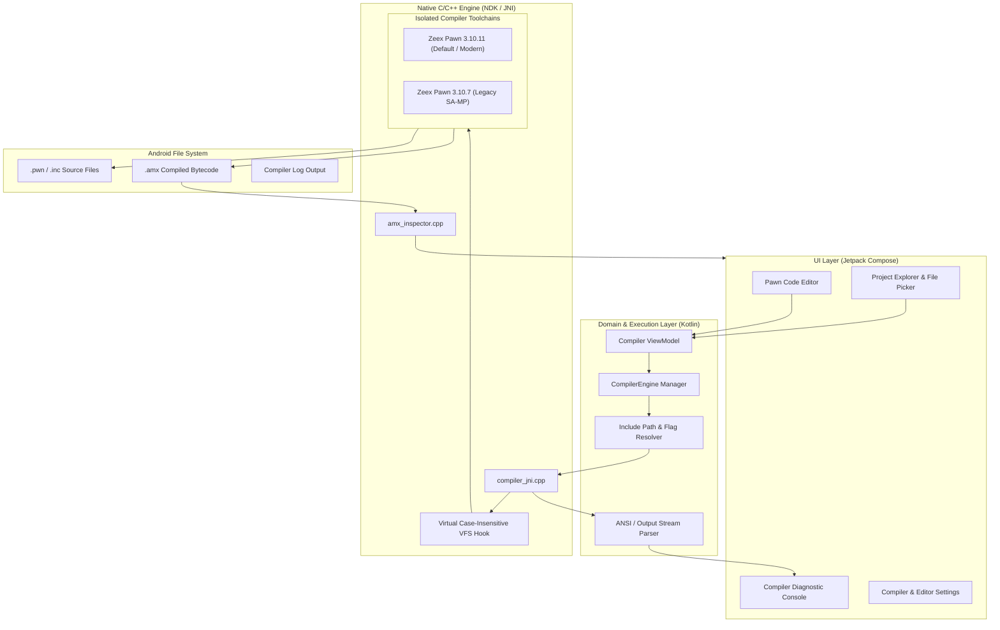

# Pawno Studio Mobile

<p align="center">
  
</p>

<p align="center">
  <strong>The Ultimate Android IDE & Native Pawn Compiler for SA-MP and open.mp Development</strong>
</p>

<p align="center">
  
  
  
  
  
  
</p>

---

## 📌 Overview

**Pawno Studio Mobile** is a production-grade, native integrated development environment (IDE) built specifically for Android to develop, refactor, and compile **Pawn** scripts for **San Andreas Multiplayer (SA-MP)** and **open.mp**.

Engineered from the ground up for high performance and stability, Pawno Studio Mobile embeds the full Pawn community compiler directly into the Android application via the **Android NDK** and **JNI**. It offers 100% offline, local compilation with zero dependency on external servers or cloud services—delivering desktop-grade compilation speeds right in your pocket.

Whether maintaining legacy roleplay gamemodes or architecting modern modular SA-MP systems exceeding 150,000+ lines of code, Pawno Studio Mobile handles massive include trees, complex preprocessor macros, and heavy AMX binaries effortlessly.

---

## ⚡ Key Features

- **Embedded Native C Compiler**: Direct execution of Zeex Pawn 3.10.11 & 3.10.7 compiled for `arm64-v8a`, `armeabi-v7a`, and `x86_64`.
- **Multi-Compiler Architecture**: Seamlessly switch between compiler toolchains depending on script dependencies and legacy compatibility.
- **Massive Modular Gamemode Support**: Tested and optimized on real-world 100,000+ line gamemodes (such as modular YSI / open.mp / complex roleplay frameworks).
- **Case-Insensitive Include Resolution**: Windows-style include paths (e.g., `#include <a_samp>`) are automatically resolved on case-sensitive Android/Linux file systems.
- **Engine Enhancements & Syntax Fixes**:
  - Auto-deduction of uncounted multidimensional array bounds (`new arr[N][0] = { ... }`).
  - Graceful constant evaluation of IEEE 754 float division by zero (`1.0 / 0.0` for `isinf()`).
  - Extended memory ceilings and configurable stack allocation up to 16 MB.
- **Optimized Mobile Editor**:
  - Pawn syntax highlighting with low latency.
  - Dedicated quick-access Pawn symbol bar (`{`, `}`, `(`, `)`, `;`, `[`, `]`, `&`, `|`, `"`).
  - Jump-to-line error navigation directly from compiler diagnostics.
- **Interactive Compiler Console**: Real-time diagnostic stream with color-coded errors and warnings, complete with elapsed time metrics.
- **AMX Binary Inspector**: Inspect compiled `.amx` bytecodes, verify public functions, inspect native imports, and monitor stack/heap reserve consumption.
- **Google Stitch Minimalist Design**: Flat 2D layout, high-contrast typography, and distraction-free dark aesthetics designed for prolonged coding sessions.

---

## 🏗️ Architecture & Workflow

Pawno Studio Mobile utilizes a layered architecture separating UI, Domain, and Native Engine runtimes. The Kotlin UI orchestrates the workspace, while the execution layer binds directly into custom-patched C/C++ compiler binaries via JNI.

### System Architecture



---

### Compilation Sequence

```mermaid
sequenceDiagram
    autonumber
    actor Dev as Developer
    participant UI as Editor Screen
    participant VM as Compiler ViewModel
    participant NDK as Native JNI (compiler_jni.cpp)
    participant C as Pawn C Engine (sc1.c / sc3.c)
    participant Disk as Local Storage

    Dev->>UI: Tap 'Compile / Build'
    UI->>VM: Trigger compilation request
    VM->>Disk: Auto-save active .pwn buffer
    VM->>VM: Collect include folders & flags (-d, -O, -v, -S)
    VM->>NDK: invokeNativeCompile(sourcePath, amxPath, includePaths, flags)
    
    rect rgb(30, 30, 30)
        Note over NDK,C: Native C Execution (In-Process Sandbox)
        NDK->>C: Initialize pawnc environment & reset global state
        C->>Disk: Load main script and recursively scan #include
        C->>C: Preprocessing, Lexing, Syntax & Semantic Analysis
        C->>C: Code generation & Bytecode optimization
        C->>Disk: Write .amx binary file
        C-->>NDK: Stream diagnostics (stdout / stderr)
    end

    NDK-->>VM: Return exit code & raw diagnostic output
    VM->>VM: Parse line numbers, error codes, and warnings
    VM->>UI: Update diagnostic bottom sheet with actionable error links
    UI-->>Dev: Display Build Succeeded / Failed notification
```



---

## 🛠️ Project Structure

```
Pawno/
├── app/
│   ├── src/
│   │   ├── main/
│   │   │   ├── cpp/                          # Native C/C++ Sources
│   │   │   │   ├── compilers/
│   │   │   │   │   ├── pawnc-3.10.11/        # Zeex Pawn 3.10.11 Source (Patched)
│   │   │   │   │   └── pawnc-3.10.7/         # Zeex Pawn 3.10.7 Source (Patched)
│   │   │   │   ├── compiler_jni.cpp          # JNI Bridge & Process Controller
│   │   │   │   ├── amx_inspector.cpp         # Native AMX Parsing Library
│   │   │   │   └── CMakeLists.txt            # NDK CMake Build Specification
│   │   │   ├── java/com/pawno/studio/
│   │   │   │   ├── core/                     # Coroutines Dispatcher & App Constants
│   │   │   │   ├── data/                     # Preferences, State & Repository
│   │   │   │   ├── editor/                   # Pawn Lexer & Tokenizer
│   │   │   │   ├── ui/                       # Jetpack Compose Screens & Theme
│   │   │   │   │   ├── components/           # Flat 2D Reusable UI Components
│   │   │   │   │   ├── navigation/           # Screen Route Definitions
│   │   │   │   │   ├── screens/ide/          # Code Editor & Workspace
│   │   │   │   │   ├── screens/diagnostics/  # Diagnostic Log Stream
│   │   │   │   │   ├── screens/settings/     # Compiler Flag Configurations
│   │   │   │   │   ├── screens/amx/          # AMX Bytecode Inspector
│   │   │   │   │   └── screens/about/        # System Specs & Credits
│   │   │   │   └── PawnoApp.kt               # Application Entry Point
│   │   │   └── res/                          # Android Resources & Icons
│   │   └── build.gradle.kts                  # App Module Configuration
│   └── proguard-rules.pro                    # R8 Code Shrinker Rules
├── gradle/                                   # Gradle Wrapper Files
├── build.gradle.kts                          # Root Project Configuration
├── settings.gradle.kts                       # Subproject Declarations
└── README.md                                 # Project Documentation
```

---

## ⚙️ Compilation Options & Defaults

Pawno Studio Mobile provides fine-grained control over compiler arguments:

| Flag | Parameter | Default | Description |
| :--- | :--- | :--- | :--- |
| `-d` | Debug Level | `-d3` | Injects full symbolic debugging information for crashdetect. |
| `-O` | Optimization | `-O1` | Optimizes bytecode execution while maintaining debug symbol fidelity. |
| `-S` | Stack Size | `-S16384` | Sets the default stack and heap reserve size (in cells). |
| `-v` | Verbose | `Off` | Displays compiler progress and include parsing details. |
| `-i` | Include Path | Auto | Automatically discovers and appends include folders recursively. |

---

## 🚀 Building from Source

### Prerequisites

- **Android Studio**: Ladybug / Meerkat (2024+) or IntelliJ IDEA with Android plugin.
- **Java Development Kit**: JDK 17 (recommended: OpenJDK 17 or Eclipse Temurin).
- **Android SDK**: API 34 (Android 14) platform components.
- **Android NDK**: Version `26.1.10909125` or newer.
- **CMake**: Version `3.22.1` or newer.

### Build Steps

1. **Clone the repository**:
   ```bash
   git clone https://github.com/DragoniaCompany1/Pawno-Studio-Mobile.git
   cd Pawno-Studio-Mobile
   ```

2. **Configure Local Environment**:
   Ensure `local.properties` specifies your Android SDK directory:
   ```properties
   sdk.dir=/path/to/Android/Sdk
   ndk.dir=/path/to/Android/Sdk/ndk/26.1.10909125
   ```

3. **Build the Debug APK**:
   ```bash
   ./gradlew assembleDebug
   ```
   The compiled APK will be generated at:
   `app/build/outputs/apk/debug/app-debug.apk`

---

## 👥 Credits & Acknowledgements

- **Lead Developers**: M.B.A & AXEL (**Blackpanther Company**)
- **Acknowledgement**: Referensi diambil dari Pawn-MC.
- **Pawn Language & Compiler**:
  - ITB CompuPhase (Original Pawn 3.2 specification)
  - Zeex & SA-MP Community (Pawn 3.10 compiler branches)
- **SA-MP & open.mp Communities**: For continuous ecosystem innovation, libraries, and include specifications.

---

## 📄 License

Copyright © 2026 Blackpanther Company. All rights reserved.  
*Private & Proprietary. Unauthorized copying, modification, or distribution is strictly prohibited.*
